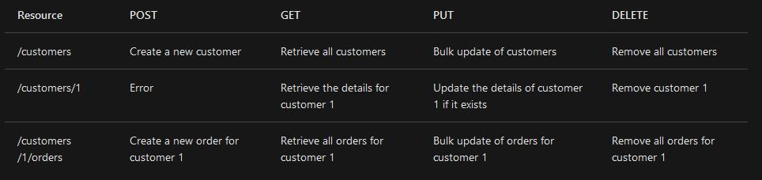

### Link Home:
[Home](README.md)

# Reading Notes Code 301: Day 8

## API Design Best Practices

- An API should try to have:
  - Platform independence
  - Service evolution

- REST = architectural style that the whole internet is built on

- Most common REST operations are: 
  - GET
  - POST
  - PUT
  - PATCH
  - DELETE

- Example of a JSON representation of an order ([source](https://docs.microsoft.com/en-us/azure/architecture/best-practices/api-design)):
```
"links": [
  {"rel":"product","href":"https://adventure-works.com/customers/3", "action":"GET" },
  {"rel":"product","href":"https://adventure-works.com/customers/3", "action":"PUT" }
]
```

### "Organize the API around resources"

- Ideally, resource URIs should be built off nouns instead of verbs, for example, this is good:
```
https://tim-world.com/orders
```
While this should be avoided:
```
https://tim-world.com/make-order
```

- Get in the habit of being consistent with your naming conventions. Use plurals for collections, and use hierarchies for parent/children content. This will save you headaches in the future!

### "Define operations in terms of HTTP methods"

- GET - gets a resource at a specific URI
  
- POST - *creates* a new resource at a specific URI
  
- PUT - creates **or** replaces/updates the resource at a specific URI
  
- PATCH - **partially** updates a resource
  
- DELETE - deletes a resource at a specific URI
  
Common conventions:


([source](https://docs.microsoft.com/en-us/azure/architecture/best-practices/api-design#define-operations-in-terms-of-http-methods))

### Conform to HTTP semantics

- POST created-resources return an HTTP status code of 201. If it is not new, it returns the HTTP status of 200. If there is no result to return, the HTTP status is 204.

- Codes:
  - 200 = OK
  - 201 = created
  - 202 = accepted
  - 204 = no content
  - 400 = bad request
  - 404 = not found
  - 409 = conflict
  - 415 = unsupported media type

> Consider supporting query strings that specify the maximum number of items to retrieve and a starting offset into the collection. For example:
> ```
> /orders?limit=25&offset=50
> ```
> Also consider imposing an upper limit on the number of items returned, to help prevent Denial of Service attacks
> 
> ([source](https://docs.microsoft.com/en-us/azure/architecture/best-practices/api-design#filter-and-paginate-data))

- HATEOAS = Hypertext as the Engine of Application State

### Versioning

- Since our API's will probably not be static, we should take into account the snowball effect that these changes will have on parties using the API. Using versioning means people using the API can choose to update to the latest version

- Types of versioning styles explained [here](https://docs.microsoft.com/en-us/azure/architecture/best-practices/api-design#no-versioning)