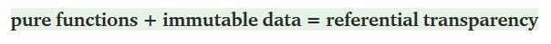
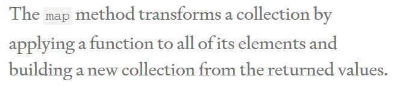

### Link Home:
[Home](README.md)

# Reading Notes Code 301: Day 9

> Functional programming is a programming paradigm -- a style of building the structure and elements of computer programs -- that treats computation as the evaluation of mathematical functions and avoids changing-state and mutable data
> - Wikipedia

- Pure Functions return the same result if given the same arguments 
    - "If our function reads external files, it's not a pure function -- the files contents can change" ([source](https://medium.com/the-renaissance-developer/concepts-of-functional-programming-in-javascript-6bc84220d2aa))
    - Functions that utilize random numbers are not pure
    - They should also not result in any "observable side effects"
  
- Pure Functions are easier to test

- Remember that `trim` erases the white space from both ends of a string

([source](https://medium.com/the-renaissance-developer/concepts-of-functional-programming-in-javascript-6bc84220d2aa))

- Functions as first-class entities = functions that can also be used as values/data
  - They can be referred to as variables (and constants)
  - Can be passes as parameters
  - Can be returned
  - Combine functions to create new functions!
  
- Higher-order functions take in a function as an argument or return one

- Imperative vs. Declarative approach
  - Imperative says precisely what we want our function to do

([source](https://medium.com/the-renaissance-developer/concepts-of-functional-programming-in-javascript-6bc84220d2aa))

> There's a middle ground between speed and comprehension and that's where good code lives. ([source](https://dev.to/healeycodes/refactoring-javascript-for-performance-and-readability-with-examples-1hec))

- Code correctly *the first time* because you might not always get a chance to refactor!