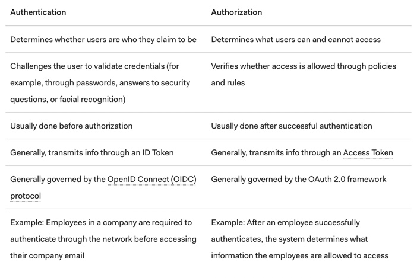

### Link Home:
[Home](README.md)

# Reading Notes Code 301: Day 11

## What is OAuth

> OAuth allows websites and services to share assets among users. It is widely accepted, but be aware of its vulnerabilities. ([source](https://www.csoonline.com/article/3216404/what-is-oauth-how-the-open-authorization-framework-works.html))

- OAuth is responsible for us being able to access websites for an entire day without having to re-enter our credentials

- Created and supported by Twitter, Google, and others. Later adopters would be Facebook, Amazon, Microsoft, LinkedIn, Netflix, PayPal

- OAuth is best known for allowing you to log in to certain websites using another website/services login credentials ("log in with Google")

> OAuth... [is] similar to a car’s valet key, which can be used to allow a valet to temporarily drive and park a car, but it doesn’t allow the holder full, unlimited access like a regular key. Instead the car can only be driven a few miles, can’t access the trunk or locked glove box, and can have many other limitations. ([source](https://www.csoonline.com/article/3216404/what-is-oauth-how-the-open-authorization-framework-works.html))

- Provides  websites a limited use of a user's credentials on another site/service

- OAuth is a *framework* and only works with HTTPS

- How it works:

1. 1st website connects to 2nd website via OAuth, verifying user's identity
2. 2nd website creates a single-use token and secret
3. 1st site gives that token and secret to user's client software
4. Authorization provider (potentially the 2nd site) accepts token and secret from client
5. Client asked to authenticate
6. User approves request
7. User is given an *approved* access token
8. User gives said token to 1st site
9. 1st site gives 2nd site proof of authentication
10. 2nd site allows 1st site to access their page on behalf of user
11. User observes the transaction

([Step by step reworder, but taken from here](https://www.csoonline.com/article/3216404/what-is-oauth-how-the-open-authorization-framework-works.html))

- OpenID is an alternative to OAuth, but with a more human element (whereas OAuth is a service/site accessing another service/site)

- SAML is another alternative to OAuth, and is an "XML variant language," but doesn't use JSON like OAuth does

- OAuth is vulnerable to phishing

## Authorization and Authentication Flows

- Authentication and Authorization are used interchangeably, but are actually completely different

- Authentication verifies who a user is (showing your ID to airport security), authorization verifies what that user has access to (showing your boarding pass to airline crew)

([source](https://auth0.com/docs/flows))