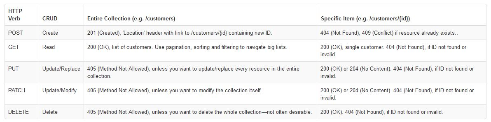

### Link Home:
[Home](README.md)

# Authentication

> Explain what a “Singleton” is (in Computer Science terms)

A Singleton is a design pattern "...that restricts the instantiation of a class to one "single" instance. This is useful when exactly one object is needed to coordinate actions across the system. The term comes from the mathematical concept of a singleton." ([source](https://en.wikipedia.org/wiki/Singleton_pattern))

"Design patterns are reusable, reliable solutions to problems that we face every day in software development." ([source](https://medium.com/@maheshkumawat_83392/node-js-design-patterns-singleton-pattern-series-1-1e0ab71e3edf))

> Explain how the Singleton pattern can be used with Node modules, specifically with classes

 ([source](https://opensource.com/article/19/7/understanding-software-design-patterns))

"Modules are cached after the first time they are loaded. This means (among other things) that every call to require(‘foo’) will get exactly the same object returned, if it would resolve to the same file."([source](https://medium.com/swlh/node-js-and-singleton-pattern-7b08d11c726a))

> If you were tasked with building a middleware system like Express uses, what approach might you take to construct/operate it?

If it were up to me, I'd be a bit more specific, or at least more clear, about what `next()` targets. That is, which step is next in the `next()` cycle. I suppose I would create middleware like we've been doing in lab, checking if a condition is met/satisfied, then telling the code to move on to the next file in the hierarchy. 

## Document the following Vocabulary Terms:

- Router Middleware

"Express middleware are functions that execute during the lifecycle of a request to the Express server. Each middleware has access to the HTTP request and response for each route (or path) it’s attached to" ([source](https://developer.okta.com/blog/2018/09/13/build-and-understand-express-middleware-through-examples))

- Dynamic Module Loading
  
"a mechanism by which a computer program can, at run time, load a library (or other binary) into memory, retrieve the addresses of functions and variables contained in the library, execute those functions or access those variables, and unload the library from memory." ([source](https://en.wikipedia.org/wiki/Dynamic_loading))

- Singleton Pattern

A singleton represents a single instance of an object. Only one can be created, no matter how many times the object is instantiated. If there’s already an instance, the singleton will create a new one." ([source](https://medium.com/@maheshkumawat_83392/node-js-design-patterns-singleton-pattern-series-1-1e0ab71e3edf))

- CRUD -> REST Method Matches

- Mock Testing

"A programmer typically creates a mock object to test the behavior of some other object, in much the same way that a car designer uses a crash test dummy to simulate the dynamic behavior of a human in vehicle impacts."([source](https://en.wikipedia.org/wiki/Mock_object))