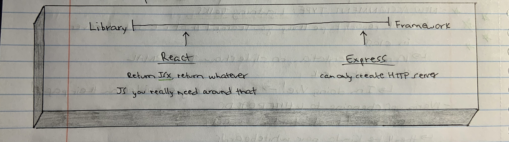

### Link Home:
[Home](README.md)

# Component Based UI
    
    
- Name 5 Javascript UI Frameworks (other than React)

Vue, Angular, Svelte, Ember, Meteor

- What’s the difference between a framework and a library?

A framework is like a foundation with a 'prescribed workflow'. A library is some code that you install which fits into your code.

## Document the following Vocabulary Terms:

- Rendering

Having elements print/display onto the browser.

- Templates

Pre-built code that comes ready to plug into your project. 

- State

Holds on to information from elsewhere in the code for future use. 