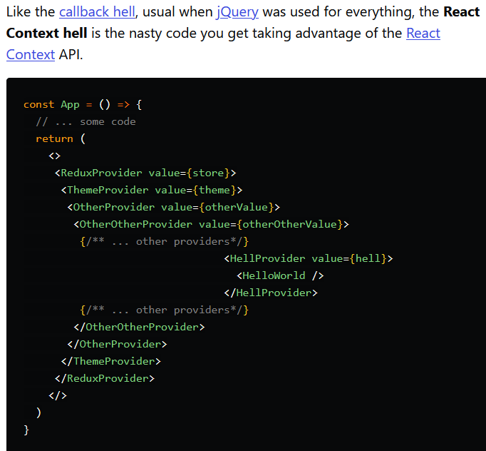

### Link Home:
[Home](README.md)

# `<Login /> and <Auth />`

- Why is the Context API useful?

> The React Context API is a way for a React app to effectively produce global variables that can be passed around. This is the alternative to "prop drilling" or moving props from grandparent to child to parent, and so on. Context is also touted as an easier, lighter approach to state management using Redux. ([source](https://www.loginradius.com/blog/async/react-context-api/))

- Can a component outside of a provider get its context?

No.

- What are some common use cases for using the Context API?

Themes such as dark mode/light mode, multilingual applications, and setting a user's role/info (authorization).

([source](https://blog.bitsrc.io/why-you-should-consider-the-new-context-api-in-react-a-deep-dive-d588b66c57b5))

- Describe “Context Hell”

This image summarizes it better than words can:

tldr: endless nested context pieces in your app.

[This link](https://dev.to/alfredosalzillo/the-react-context-hell-7p4) was used as the source for the image above, and it goes into some solutions to avoid context hell.

## Document the following Vocabulary Terms:

- global state

> To put it simply, global state is the data that is shared between all the components within a React application. When the state is changed, or let's say a filter is added, the components re-render accordingly. ([source](https://endertech.com/blog/using-reacts-context-api-for-global-state-management))

- global context

> Context is designed to share data that can be considered “global” for a tree of React components, such as the current authenticated user, theme, or preferred language. ([source](https://reactjs.org/docs/context.html))

- provider

> The Provider component accepts a value prop to be passed to consuming components that are descendants of this Provider. One Provider can be connected to many consumers. Providers can be nested to override values deeper within the tree. ([source](https://reactjs.org/docs/context.html#contextprovider))

- consumer

> A React component that subscribes to context changes. Using this component lets you subscribe to a context within a function component. ([source](https://reactjs.org/docs/context.html))
