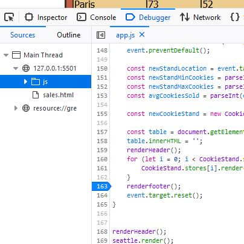

### Link Home:
[Home](README.md)

# Reading Notes Code 201: Day 10

### Notes - JavaScript Book, Ch. 10, “Error Handling & Debugging”

**Order of Execution**
>"the order in which statements are processed" 
> 
> -Jon Duckett, JavaScript & JQuery, page 452

Execution Context

- Global 
- Function 
- Eval 

Variable Scope

- Global
- Function-Level

2 phases after a script goes into a "new execution context":
1. Prepare
2. Execute

Preparing creates a new scope, along with functions/arguments/variables. Executing assigns values to those things, references functions, and executes.

**Hoisting** brings functions/variables to the top of the execution context

Although it seems counter-intuitive, the code below would work just fine:

```
let userName = newUser ();
function newUser();{
}
```
That's because it is handled like this:

```
function newUser(){
}
let userName = newUser();
```

This block of *similar* code would fail, since `newUser` is inside `createGreeting`:

```
let userName = newUser();
function createGreeting(){
    function newUser();
}
}
```

Functions have **lexical scope**. "They are linked to the object they were defined *within*. So, for each execution context, the scope is the current execution context's `variables` object, *plus* the `variables` object for each parent execution context" (Duckett, *JavaScript & JQuery*, page 457)

Look for **exceptions** when trying to find an error in your code

---
#### Error Objects

Here are some error objects that you might come across in your console:

Property | Description
------------ | -------------
`name` | The type of error
`message` | Description of the error
`fileNumber` | Name of the JS file
`lineNumber` | Line number of the error

(note: the above is borrowed heavily from Jon Duckett's *JavaScript & JQuery* page 459)

7 Types of Error Objects:

1. Error (generic)
2. SyntaxError
3. ReferenceError
4. TypeError
5. RangeError
6. URIError
7. EvalError

Try, catch, throw, finally statements

Identifying where the problem is:
- Check error messages, they'll tell you where the error is occurring (line number), along with the cause
- See how far along your code the script is actually running
- Breakpoints
- (Personal addition) - add `console.log()`

(The book actually mentions console logs later on)

`console.group()` can group a set of related data

--- 
#### Breakpoints

These are what Chance walked you through during Salmon Cookies (when you were working on adding form info to a table)! They allow you to stop a script at any line. 

Go into the console > debugger > click on a line



You can also step through the code on the right side of the debugger (also did this with Chance).

Add breakpoints directly to your code with `debugger;`